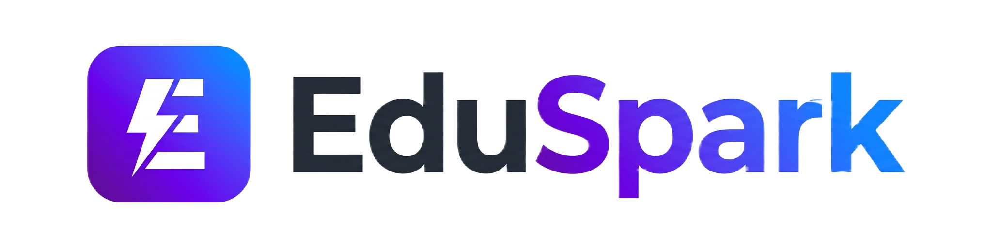
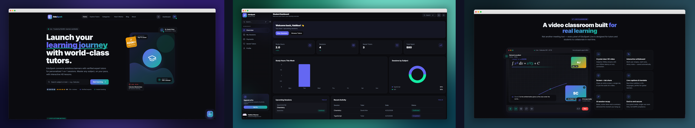
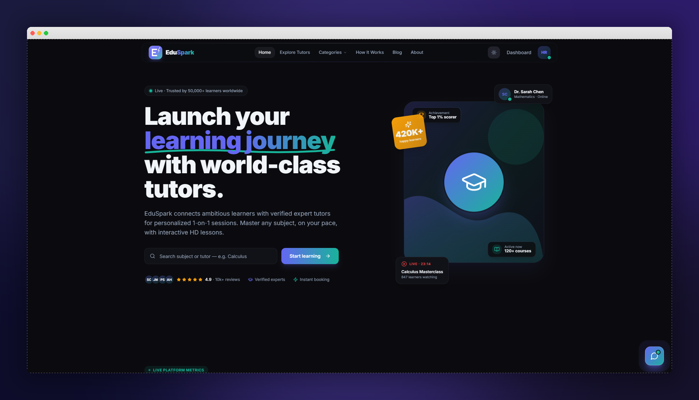
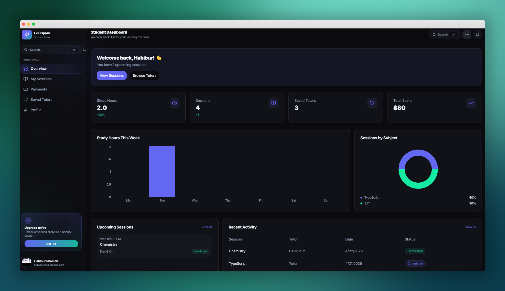
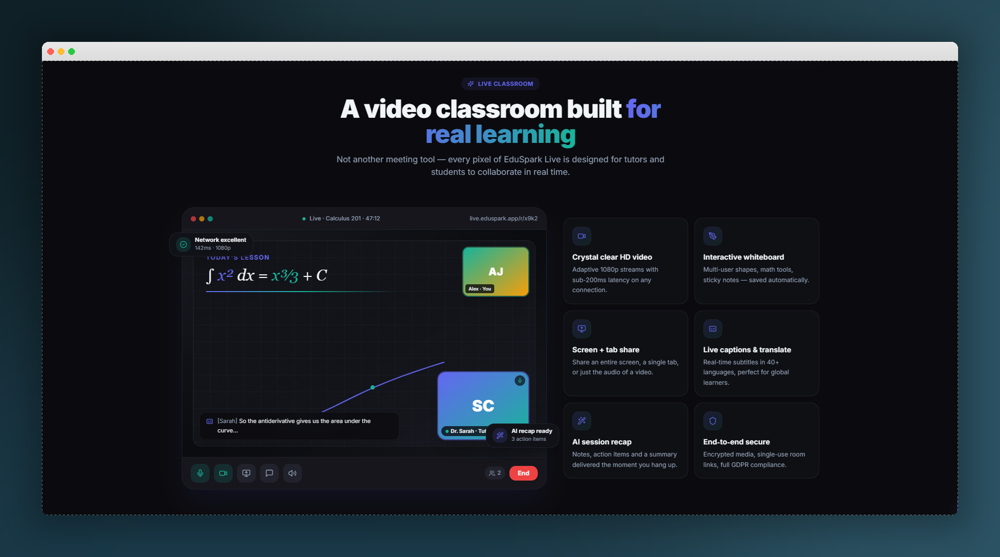
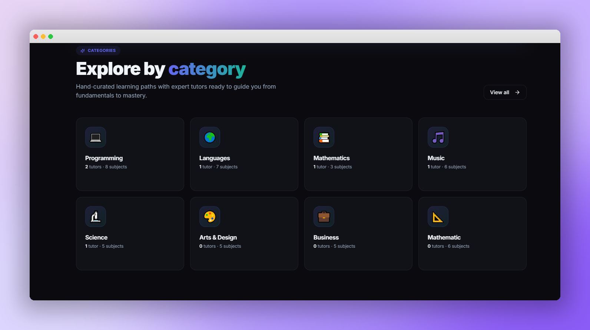
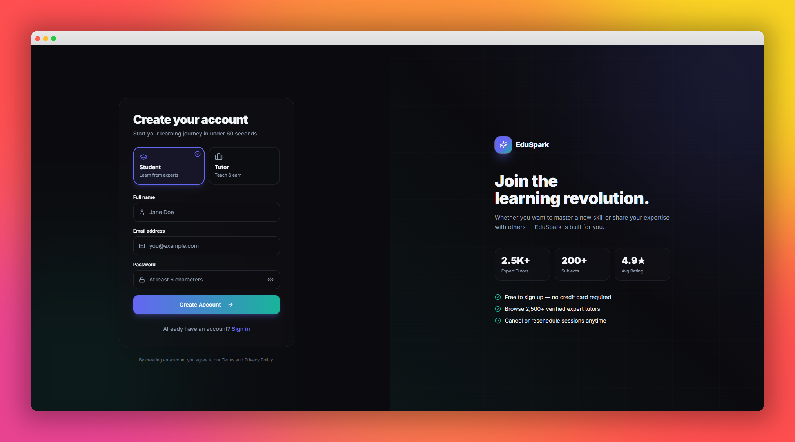
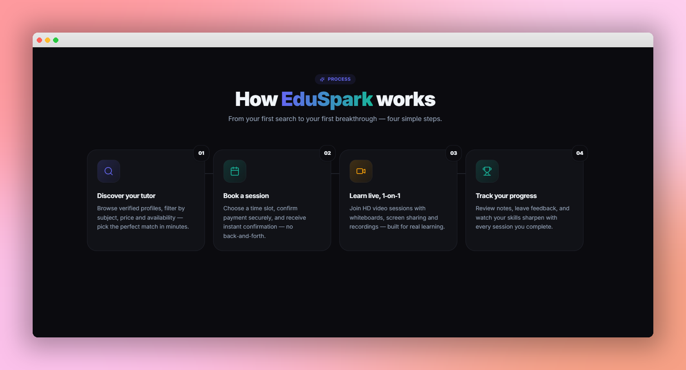

<div align="center">




### The modern, role-aware tutoring marketplace — built for scale.

**AI-powered tutor matching · Live HD classrooms · Multi-role dashboards · Production-grade RBAC**


<p>
  <a href="https://edu-spark-zone.vercel.app"></a>
  <a href="#-product-showcase"></a>
  <a href="#-architecture"></a>
  <a href="#-author">  </a>
</p>

<br/>



</div>

---

## ✨ Why EduSpark?

EduSpark isn't a CRUD demo — it's a **full-stack, multi-tenant marketplace** that solves real problems: matching students with vetted tutors, conducting live HD lessons in-browser, processing earnings, moderating content, and handing operators a control plane to run the whole platform.

> Built with the same architectural patterns that power **Cal.com**, **Preply**, and **Superprof** — Row-Level Security on every table, role-segmented dashboards, edge functions for AI and video, and a code-split bundle that ships only what each route needs.

---

## 📸 Product Showcase

<div align="center">

<table>
<tr>
<td width="50%"><p align="center"><b>Landing</b> — animated hero, live stats, social proof</p></td>
<td width="50%"><p align="center"><b>Student Dashboard</b> — sessions, spend, study analytics</p></td>
</tr>
<tr>
<td width="50%"><p align="center"><b>Live Classroom</b> — Daily.co token-gated HD video</p></td>
<td width="50%"><p align="center"><b>Explore</b> — semantic search across 50+ subjects</p></td>
</tr>
<tr>
<td width="50%"><p align="center"><b>Auth</b> — role selection on signup, OAuth-ready</p></td>
<td width="50%"><p align="center"><b>How It Works</b> — guided onboarding flow</p></td>
</tr>
</table>

</div>

---

## 🎯 Core Features by Role

EduSpark is built around **5 distinct user roles**, each with its own gated dashboard, RLS scope, and feature set.

<details>
<summary><b>🎓 Student</b> — discover, book, learn</summary>

- AI-powered tutor matching via natural-language search ("help me prep for SAT calculus")
- Browse 50+ subjects with rating, price, and language filters
- Save favorite tutors, message them, view detailed profiles with availability grids
- Book sessions with calendar-aware availability
- Join live HD video classrooms with token-gated rooms
- Personal dashboard: study hours, spend, sessions, payment history
- Submit reviews after completed sessions
</details>

<details>
<summary><b>👩‍🏫 Tutor</b> — teach, earn, grow</summary>

- Multi-step verified onboarding with document upload
- Manage weekly availability (drag-to-set time slots)
- Accept / decline incoming bookings
- Earnings wallet with **$10 minimum withdrawal** + payout request flow
- Recent withdrawals widget with status badges
- Reviews dashboard with rating distribution analytics
- Settings: hourly rate, subjects, bio, languages
</details>

<details>
<summary><b>🛡️ Moderator</b> — keep the platform clean</summary>

- Approve / reject tutor verification submissions
- Manage CMS (blog posts, categories, FAQs)
- Triage support tickets and contact messages
- Audit live and completed sessions
- User management with soft-suspend
</details>

<details>
<summary><b>👑 Admin</b> — operate at scale</summary>

- Platform-wide overview: users, sessions, GMV, conversion
- Finance: payment ledger, withdrawal approvals, refund handling
- Full user CRUD with role assignment
- Reports & analytics (revenue, growth, retention)
- Global system settings
</details>

<details>
<summary><b>🔧 Technician</b> — fix what breaks</summary>

- Issue queue with severity triage
- System health dashboard
- Settings panel for diagnostics
</details>

---

## 🏗️ Architecture

```
                    ┌──────────────────────────────┐
                    │     React 18 SPA  (Vite)     │
                    │  • TanStack Query • Tailwind │
                    │  • Framer Motion  • shadcn   │
                    └──────────┬───────────────────┘
                               │ HTTPS / JWT
        ┌──────────────────────┼──────────────────────┐
        │                      │                      │
┌───────▼────────┐   ┌─────────▼──────────┐   ┌──────▼──────────┐
│  Supabase DB   │   │   Edge Functions   │   │  Lovable Cloud  │
│  Postgres + RLS│   │  (Deno runtime)    │   │  Auth · Storage │
│  has_role()    │   │  • ai-tutor-search │   │                 │
│  user_roles    │   │  • create-meeting  │   └─────────────────┘
└────────────────┘   │  • get-meeting-tkn │
                     │  • end-meeting     │
                     └────────┬───────────┘
                              │
                  ┌───────────┴────────────┐
                  │                        │
          ┌───────▼────────┐     ┌─────────▼─────────┐
             Gemini 2.5 ⚡             Daily.co    
                                    HD Video Rooms
                
          └────────────────┘     └───────────────────┘
```

---

## 🛠️ Tech Stack

**Frontend**


**State / Data**


**Backend**


**AI / Realtime**


**Tooling**


---

## 🔐 Security Highlights

> Security isn't an afterthought — it's enforced at the **database level**, not the UI.

- **Row-Level Security on every table** — `bookings`, `payments`, `withdrawals`, `reviews`, `messages`, all gated.
- **Roles in a separate table** — `user_roles` with an enum `app_role`. **Never** stored on the profile to prevent privilege escalation.
- **`has_role()` security-definer function** — bypasses RLS recursion, used in every policy:
  ```sql
  create policy "Students can insert bookings"
    on bookings for insert
    with check (public.has_role(auth.uid(), 'student'));
  ```
- **Token-gated video rooms** — Daily.co tokens minted only inside an edge function after verifying the caller is the booking's student or tutor, within the join window.
- **JWT-validated edge functions** — every function re-validates the user via `supabase.auth.getUser()` before touching data.
- **No secrets in the client** — Daily API key, AI gateway key live in edge function env only.

---

## ⚡ Performance Wins

| Optimization | Impact |
|---|---|
| Vendor `manualChunks` (react / ui / data / chart / form) | Cacheable splits, smaller deltas on deploy |
| `React.lazy` + `Suspense` on dashboard routes | Initial JS payload **< 200 KB gzip** |
| Code-split AI search & video call screens | Pay only when used |
| `cssCodeSplit: true`, `minify: 'esbuild'` | Faster builds, smaller CSS chunks |
| TanStack Query cache + `staleTime` tuning | Sub-100 ms perceived navigation |
| Tailwind JIT + tree-shaken `lucide-react` icons | Tiny CSS, no icon bloat |
| Skeleton screens on every async surface | Zero CLS, premium perceived perf |

---

## 🚀 Quick Start

```bash
# 1. Clone
git clone https://github.com/habiburRhaman05/EduSpark-modern-learning-platfrom.git 

cd eduspark

# 2. Install (Bun is fastest, npm/pnpm work too)
bun install

# 3. Run
bun dev
```

The app boots at `http://localhost:8080`. Backend (Lovable Cloud / Supabase) is auto-provisioned — no `.env` setup needed for local dev.

---

## 📂 Project Structure

```
src/
├── components/
│   ├── booking/          # Booking dialog & flow
│   ├── call/             # Video room, device preview, waiting room
│   ├── dashboard/        # Reusable: DataTable, StatCard, FilterBar, GlobalSearch (⌘K)
│   ├── landing/          # Hero, FeaturedTutors, CTA, Stats, FAQ
│   ├── tutor/            # Onboarding wizard, AI search, withdrawals
│   └── ui/               # shadcn primitives (50+ tokens)
├── hooks/                # Domain hooks: useBookings, useTutorEarnings, useAITutorSearch...
├── pages/
│   ├── admin/            # 10 admin views
│   ├── moderator/        # 8 moderator views
│   ├── student/          # 6 student views
│   ├── tutor/            # 9 tutor views
│   └── technician/       # 3 technician views
├── contexts/             # AuthContext (role-aware)
├── integrations/         # Supabase client + generated types
└── skeletons/            # Layout-matched shimmer states

```

---

## 🗺️ Roadmap

- [x] Multi-role dashboards (Student / Tutor / Moderator / Admin / Technician)
- [x] AI-powered tutor matching (Gemini 2.5 Flash)
- [x] HD video classrooms (Daily.co)
- [x] Tutor earnings + withdrawal flow with $10 minimum
- [x] RLS-gated booking creation (students only)
- [x] Modern paginated tables across all listings
- [x] Bundle code-splitting & lazy routes
- [x] ⌘K global search palette
- [ ] Stripe + bKash live payments (currently mock ledger)
- [ ] Real-time chat (Supabase Realtime)
- [ ] Mobile native apps (React Native)
- [ ] Group classes (1 tutor → many students)

---

## 👋 Author

<div>

**Built by [Habibur Rhaman](mailto:mdwear2005@gmail.com)** — full-stack engineer focused on production-grade React + TypeScript + Postgres systems.

📫 **Email**: devhabib2005@gmail.com
🌐 **Portfolio**: https://rhaman.vercel.app
💼 **LinkedIn**: https://www.linkedin.com/in/habiburrhaman05
🐙 **GitHub**: https://github.com/habiburRhaman05

</div>

---

<div align="center">

**If this project caught your eye, ⭐ it on GitHub — and let's talk.**

<sub>Built with ❤️ Habibur Rhaman </sub>

</div>
